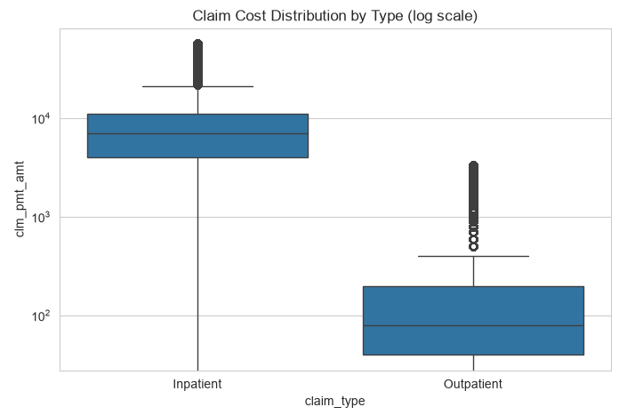
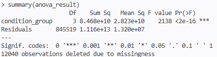

# CMS Healthcare Cost Transparency Analytics

A healthcare claims cost-analysis pipeline built on CMS synthetic Medicare claims data (DE-SynPUF), modeled on the type of cost-trend and utilization reporting produced for state Health Care Cost Transparency Boards.

## Project Summary

This project analyzes synthetic Medicare claims data to surface cost trends, utilization patterns, and spending drivers, the kind of analysis a state Health Care Authority's Cost Transparency Board uses to inform healthcare affordability policy. The pipeline covers the full analytics lifecycle: data cleaning, relational database loading, SQL-based cost aggregation, exploratory visualization, and statistical inference on cost drivers.

**Note on data**: This project uses CMS's Data Entrepreneurs' Synthetic Public Use File (DE-SynPUF), which is fully synthetic data designed for building and testing claims-analytics tools. Per CMS's own documentation, DE-SynPUF is not intended to support real inferential conclusions about the Medicare population, the value of this project is in the analytics pipeline and methodology, not in any findings about actual healthcare trends.

Dashboard Link: https://public.tableau.com/app/profile/venkata.botta/viz/HCA_Cost_Transparency_Dashboard/Dashboard1

## Tech Stack

| Layer | Tools |
|---|---|
| Data cleaning & pipeline | Python (Pandas, NumPy) |
| Database | PostgreSQL |
| Cost aggregation | SQL |
| Exploratory analysis & visualization | Python (Matplotlib, Seaborn) |
| Statistical inference | R (t-tests, ANOVA, linear regression) |
| Dashboard | Tableau |

## Data Source

- **CMS DE-SynPUF, Sample 1** (2008–2010): Beneficiary Summary files (3 years), Inpatient Claims, Outpatient Claims
- Source: [CMS DE-SynPUF](https://www.cms.gov/data-research/statistics-trends-and-reports/medicare-claims-synthetic-public-use-files/cms-2008-2010-data-entrepreneurs-synthetic-public-use-file-de-synpuf)
- ~857,000 combined inpatient and outpatient claims

## Project Structure

```
cms-healthcare-cost-transparency-analytics/
├── data/
│   ├── raw/                     (CMS source CSVs — not committed)
│   └── processed/               (cleaned/joined outputs — not committed)
├── notebooks/
│   ├── 01_data_cleaning.ipynb   (load, clean, join claims to beneficiary data)
│   ├── 02_eda_cost_trends.ipynb (cost trends, YoY growth, cost by condition)
│   └── 03_high_cost_utilization.ipynb (distributions, top providers)
├── sql/
│   ├── 01_create_schema.sql
│   ├── 02_load_claims.sql
│   └── 03_cost_aggregation_queries.sql
├── scripts/
│   ├── cost_distribution_by_condition.R
│   ├── yoy_growth_inference.R
│   └── cost_regression_model.R
├── dashboard/
│   └── HCA_cost_transparency_dashboard.twbx
├── docs/
│   └── methodology.md
├── images/                      (query/notebook screenshots)
├── .env.example
├── .gitignore
├── requirements.txt
└── README.md
```

## What This Analysis Covers

- **Total cost of care** by claim type (inpatient/outpatient) and year
- **Year-over-year cost growth** by service category
- **Cost variation by chronic condition** (diabetes, CHF, cancer, COPD, and others)
- **Highest-cost claims and providers**
- **Statistical testing** on whether cost differences across condition groups are significant (t-tests, ANOVA)
- **Regression modeling** of claim cost as a function of beneficiary age and chronic conditions

## How to Run This Project

1. Clone the repo and set up a Python environment (conda or venv) with the packages in `requirements.txt`
2. Download CMS DE-SynPUF Sample 1 files (Beneficiary Summary 2008–2010, Inpatient Claims, Outpatient Claims) and place them in `data/raw/`
3. Copy `.env.example` to `.env` and fill in your local PostgreSQL credentials
4. Run `notebooks/01_data_cleaning.ipynb` to clean and join the data
5. Run `sql/01_create_schema.sql` in your PostgreSQL instance, then load the cleaned data (see notebook for the load script)
6. Run the aggregation queries in `sql/03_cost_aggregation_queries.sql`
7. Run `notebooks/02_eda_cost_trends.ipynb` and `notebooks/03_high_cost_utilization.ipynb` for visualization
8. Run the R scripts in `scripts/` for statistical inference
9. Open `dashboard/HCA_Cost_Transparency_Dashboard.twbx` in Tableau, or view the published version: **(https://public.tableau.com/app/profile/venkata.botta/viz/HCA_Cost_Transparency_Dashboard/Dashboard1)**

## Example Output

**Cost Distribution by Claim Type** — boxplot highlighting outliers and high-utilization claims


**Cost Difference Across Chronic Condition Groups (ANOVA)** — statistical significance testing in R


## Methodology & Limitations

See [`docs/methodology.md`](docs/methodology.md) for a full discussion of data limitations, cleaning decisions, and the reasoning behind key methodology choices.

## Author

Built as a portfolio project to demonstrate claims-analytics capability for healthcare cost transparency and policy analysis roles.

